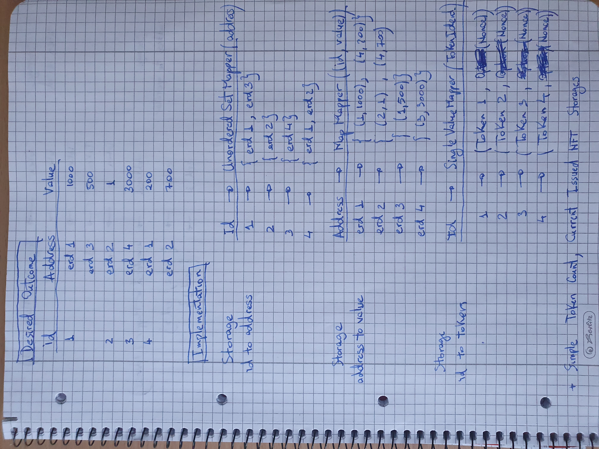
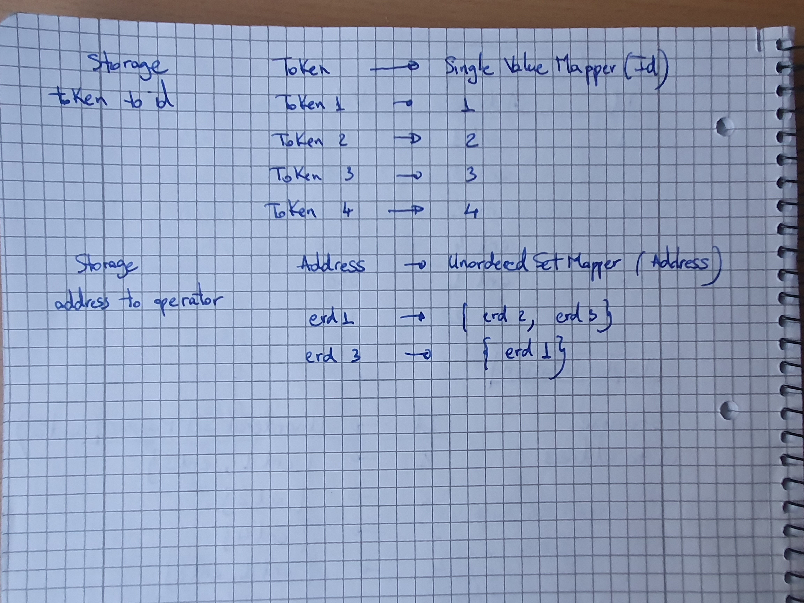

## MultiversX implementation of ERC-1155 standard

### Features 
* #### Smart contract owner can:
    + Directly mint new tokens in the Smart Contrat (```mintFungibleToken```)
    + Issue NFT Token (```issueNonFungibleToken```) and mint multiple NFTs from the issued collection in the Smart Contract (```mintNft```)  


* #### Any user can:
    + Deposit Tokens to the contract (```depositToken```)
    + Deposit NFTs to the contract (```depositNFTToken```)
    + Withdraw owned Tokens and NFTs from the contract (```withdrawToken```)
    + Interact with the contract that implements the ERC-1155 standard 

* #### Architecture:

