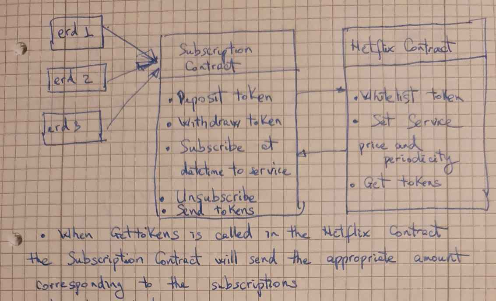
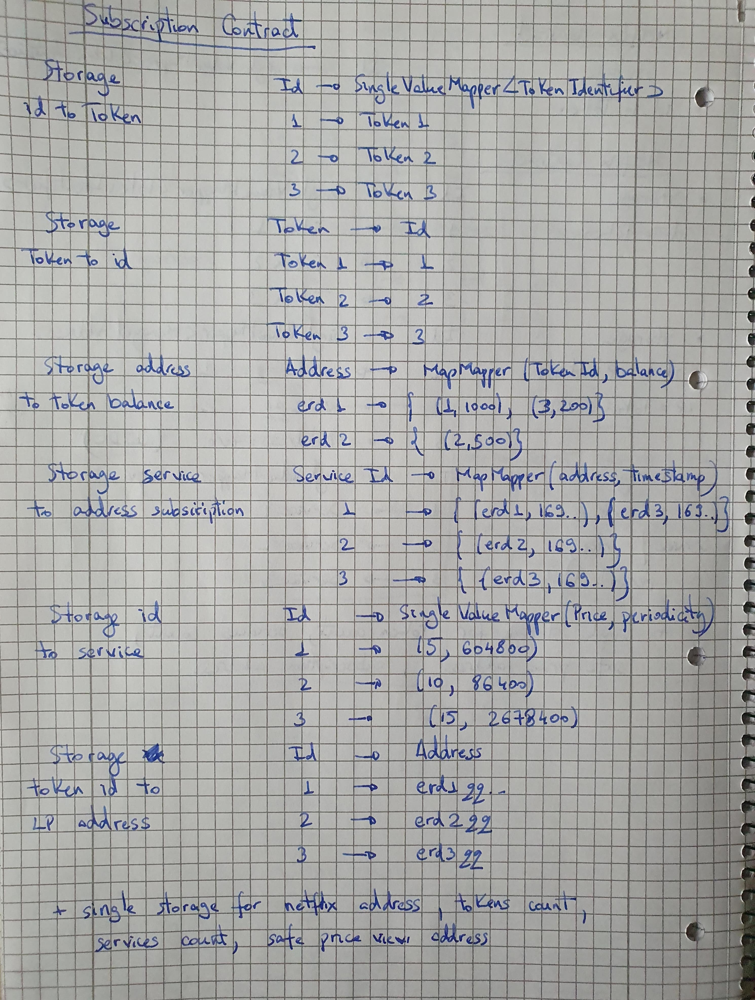

## Subscription to the Netflix contract

Similarly to the ERC-1155 contract, or as an extension of that, we can create a **Subscription** contract. This will work for the user as a funding wallet, where he deposits a certain amount of tokens, he subscribes to multiple services (**"Netflix" Smart Contract**) and those services will take tokens from the subscription contract according to predefined rules signed by the user.

#### Admin actions:
Whitelist tokenIDs which are accepted in the subscription contract.

#### Services actions:
Registers itself as a service
Define price and periodicity for their services. One service can offer multiple services.
`
#### User actions:
Deposit/withdraw tokens
Subscribe to services by approving/signing the conditions of selected services.
If the user signs a transaction in which he says approve@service1@service2@service5 - it means he agrees with the conditions
When a user subscribes to a service, the SC has to save the information regarding that service - like the service is allowed to take 5$ worth of tokens from the deposited tokens
Unsubscribe from services

#### Price:
Services might define that the price is in $ worth of X tokens. Like 5$ worth of eGLD. In this case the subscription contract has to integrate safePrice (an existing contract on the chain) which knows the price
https://github.com/multiversx/mx-exchange-sc/blob/main/dex/pair/README.md#safe-price-v2
Using the safePrice computation, the service will take X tokens which are worth Y$ at the periodicity approved by the user. (Once per week, once per month, once per day).

### Features 
 +  On deploy the subscription contract gets current whitelisted Tokens and Services and registers as a subscriber 
 +  A user can deploy and withdraw whitelisted tokens
 +  A user can subscribe and unsubscribe to multiple services 
 +  The subscription contract automatically sends tokens valued at subscription dollar price equivalent when called upon by the Neflix Contract
 
### Architecture:



 ### Safe price evaluation:

 The subscription contract calculates the token price equivalent in dollars based on LP contracts that have been deployed on the devnet. The interaction folder contains details on deploying two such LPs:
 +  ```lp1.devnet.sh``` using tokens  ```AMS-3a6740``` and ```USDC-79d9a4```  
 +  ```lp2.devnet.sh``` using tokens  ```BMS-e00535``` and ```USDC-79d9a4```  

Regarless of the chosen tokens for forming an LP pair the steps are as follows:
+ Clone the mx-eschange-sc repo (```https://github.com/multiversx/mx-exchange-sc```) 
+ Build the ```mx-exchange-sc/dex/router/``` and the ```/mx-exchange-sc/dex/pair``` contracts 
+ Move the script to the ```mx-exchange-sc/dev/interaction``` folder
+ Load the script
+ Deploy the Router Smart Contract with no Pair Smart Contract address parameter (```deployRouterContract```)
+ Deploy the Pair Smart Contract using the Router Smart Contract address and the two LP tokens as parameters (```deployPairContract```)
+ Upgrade the Router Smart Contract with the Pair Smart Contract address parameter (```upgrade```)
+ Create LP pair (```createPair```), issue LP token (```issueLpToken```) and set roles (```setLocalRoles```)
+ Add the initial liquidity (```addInitialLiquidity```). This defines the ratio of the two tokens
+ Add liquidity (```addLiquidity```). This step is needed in order to initiate the price observation. Make sure the added quantities respect the ratio defined in the add initial liquidity step!
+ (Optional) Deploy safe price contract if you haven't done so already (```deploySafePriceContract```). Only one contract is needed to view any LP tokens price ratio.
